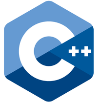

<h1 align="center">Hi 👋, I'm VIGNESH J RAJU</h1>
<h3 align="center">Industrial Engineer Exploring the World of Web Development</h3>

- 🌱 I’m currently learning **A full-stack web developement and Mern stack**

- 👨‍💻 All of my projects are available at <a href="https://vjr5.wordpress.com/">vjr5.wordpress.com </a>

- 📫 How to reach me <a href="mailto:vigneshjraju@gmail.com">vigneshjraju@gmail.com </a>

- 📄 Know about my experiences  <a href="https://vjr5.wordpress.com/">vjr5.wordpress.com </a>

- ⚡ Fun fact *** I Think iam funny! you know why? BECAUSE I'M BATMAN ***

<h3 align="left">Connect with me:</h3>

<h3 align="left">Languages and Tools:</h3>

 
 
  
  

